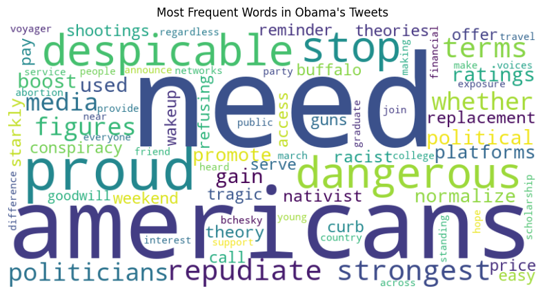
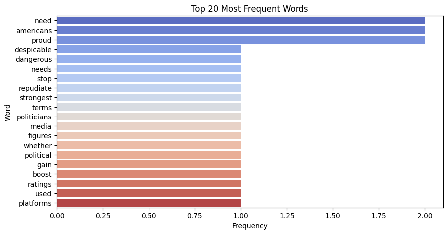
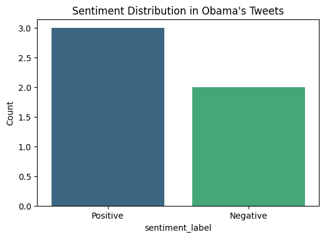
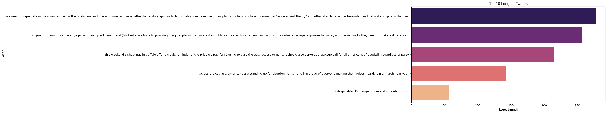

# 🐦 Obama Tweet Sentiment Analysis 📊🧠

Welcome to the **Obama Tweet Sentiment Analysis** project! This project dives into the tweets of Barack Obama, analyzing their content using Natural Language Processing (NLP) techniques to uncover insights like frequent words, sentiment trends, and tweet popularity.


---

## 🚀 Project Overview

We used a public dataset of Barack Obama’s tweets and performed:

- ✅ Data Cleaning (removing URLs, punctuation, etc.)
- ✅ Tokenization and Stopword Removal
- ✅ Lemmatization
- ✅ Word Frequency Analysis and WordCloud
- ✅ Sentiment Analysis using VADER
- ✅ Visualizations (Top Words, Sentiment Distribution, Tweet Length)

---

## 🧰 Technologies Used

- **Python 3.x**
- **Pandas**, **NumPy**
- **NLTK** – Tokenization, Lemmatization, Stopwords, Sentiment
- **Matplotlib**, **Seaborn** – Visualizations
- **WordCloud** – Word cloud generation
- **Jupyter Notebook**

---

## 📁 Dataset Source

The tweet dataset was sourced from GitHub:

📎 [tweets-obama.csv](https://raw.githubusercontent.com/kirenz/twitter-tweepy/main/tweets-obama.csv)

---

## 🔍 Key Highlights

### 📌 WordCloud of Most Frequent Words
A visual summary of the most used words in Obama's tweets.



---

### 🔥 Top 20 Most Frequent Words

Bar plot of the most frequent non-stopwords used in his tweets.



---

### 😀 Sentiment Distribution

Analyzed using **VADER** sentiment analysis from the `nltk.sentiment` module.

- **Positive**
- **Neutral**
- **Negative**



---

### 📝 Top 10 Longest Tweets

Measured by tweet character length as a simple "popularity" proxy.


---

## 🧪 How to Run

1. Clone the repository:
   ```bash
   git clone https://github.com/MK3685/obama-tweet-sentiment-analysis.git
   cd obama-tweet-sentiment-analysis
